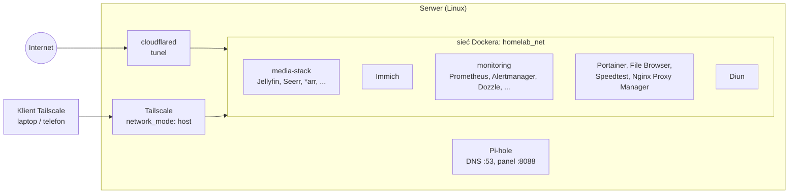

# homelab

Konfiguracja domowego serwera (homelab) oparta w całości na **Docker Compose**. Repozytorium zawiera definicje usług, limity zasobów oraz konfigurację monitoringu. Dzięki temu całe środowisko można odtworzyć na nowej maszynie w kilkanaście minut.

> **Uwaga:** repozytorium nie zawiera żadnych haseł, tokenów ani danych aplikacji. Wszystkie sekrety trafiają do plików `.env`, które są wykluczone z Gita (zob. [Sekrety](#sekrety)).

---

## Spis treści

1. [Co tu jest](#co-tu-jest)
2. [Architektura](#architektura)
3. [Usługi i porty](#usługi-i-porty)
4. [Sieć Dockera](#sieć-dockera)
5. [Dostęp zdalny i bezpieczeństwo](#dostęp-zdalny-i-bezpieczeństwo)
6. [Monitoring i alerty](#monitoring-i-alerty)
7. [Limity zasobów](#limity-zasobów)
8. [Struktura repozytorium](#struktura-repozytorium)
9. [Uruchomienie krok po kroku](#uruchomienie-krok-po-kroku)
10. [Zmienne środowiskowe](#zmienne-środowiskowe)
11. [Sekrety](#sekrety)
12. [Znane ograniczenia](#znane-ograniczenia)

---

## Co tu jest

Serwer działa na Linuksie, a każda usługa jest osobnym stosem Compose w swoim katalogu. Pozwala to uruchamiać, aktualizować i usuwać usługi niezależnie od siebie.

Środowisko obejmuje:

- **prywatne zdjęcia i wideo** (Immich, alternatywa dla Google Photos),
- **centrum multimedialne** z automatyzacją pobierania i napisów,
- **filtrowanie reklam na poziomie DNS** (Pi-hole),
- **monitoring** (Prometheus, cAdvisor, node-exporter, Alertmanager) oraz podgląd logów (Dozzle),
- **dostęp zdalny** przez VPN (Tailscale) oraz tunel Cloudflare,
- **narzędzia administracyjne** (Portainer, File Browser, Nginx Proxy Manager, Speedtest) oraz Diun, który powiadamia o nowych wersjach obrazów.

## Architektura

Wszystkie stosy (poza Tailscale i Pi-hole) są podłączone do jednej, zewnętrznej sieci Dockera `homelab_net`, dzięki czemu kontenery z różnych stosów widzą się nawzajem po nazwach. Usługi publikują swoje porty na hoście na wszystkich interfejsach (`BIND_IP=0.0.0.0`), więc są dostępne z sieci domowej i przez Tailscale niezależnie od adresu VPN serwera (zob. [Dostęp zdalny i bezpieczeństwo](#dostęp-zdalny-i-bezpieczeństwo)). Zdalny dostęp odbywa się przez Tailscale (prywatnie) lub przez tunel Cloudflare.



## Usługi i porty

Kolumna „Port” pokazuje port hosta i, po dwukropku, port w kontenerze. Porty w stosach z `BIND_IP` mają postać `${BIND_IP:-0.0.0.0}:port:port`.

### Multimedia (`media-stack/`)

| Usługa | Rola | Port | RAM / CPU |
|---|---|---|---|
| **Jellyfin** | Serwer multimediów (filmy, seriale, muzyka). Ma przekazane urządzenie `/dev/dri`, więc może korzystać z transkodowania sprzętowego (GPU/iGPU). | 8096 | 2 GB / 2 |
| **Seerr** | Portal do zgłaszania próśb o nowe tytuły. | 5055 | 1 GB / 1 |
| **Sonarr** | Zarządzanie biblioteką seriali i automatyzacja pobierania. | 8989 | 1 GB / 1 |
| **Radarr** | To samo dla filmów. | 7878 | 1 GB / 1 |
| **Prowlarr** | Centralny menedżer indeksatorów. | 9696 | 1 GB / 1 |
| **Bazarr** | Automatyczne pobieranie napisów. | 6767 | 1 GB / 0,5 |
| **qBittorrent** | Klient pobierania (panel WWW na 8081, dodatkowo port 6881 TCP i UDP). | 8081, 6881 | 2 GB (rezerwacja 400 MB) / 1,5 |
| **FlareSolverr** | Pomocnik do obsługi stron zabezpieczonych przed botami. | 8191 | 2 GB / 2 |
| **MeTube** | Interfejs webowy do pobierania materiałów wideo. Zapisuje do `${DATA_ROOT}/downloads`. | 9999:8081 | 1 GB / 1 |

Jellyfin, Sonarr, Radarr, Bazarr i qBittorrent montują ten sam katalog `DATA_ROOT` jako `/data`, dzięki czemu pobrane pliki mogą być przenoszone do biblioteki bez kopiowania. Konfiguracje usług trafiają do podkatalogów `CONFIG_ROOT` (konfiguracja Seerr leży w `CONFIG_ROOT/jellyseerr`).

### Zdjęcia (`immich/`)

**Immich** to samodzielnie hostowana aplikacja do kopii zapasowych zdjęć i wideo z telefonów. Port **2283**. Stos składa się z czterech kontenerów:

| Kontener | Rola | RAM / CPU |
|---|---|---|
| `immich_server` | Serwer aplikacji | 1,5 GB / 2 |
| `immich_machine_learning` | Rozpoznawanie twarzy, wyszukiwanie semantyczne (cache modeli w woluminie `model-cache`) | 3 GB / 2 |
| `immich_postgres` | PostgreSQL 14 z rozszerzeniami wektorowymi (VectorChord, pgvecto.rs) | 1 GB / 1 |
| `immich_redis` | Valkey 9 jako cache | 128 MB |

Obrazy bazy danych i cache są przypięte do konkretnych wersji (hash `sha256`), więc nie zmienią się przy aktualizacji innych obrazów. Pozostałe obrazy Immicha używają tagu z `IMMICH_VERSION` (domyślnie `release`). Hasło i nazwa bazy pochodzą z pliku `.env`.

### Sieć i dostęp

| Usługa | Rola | Port | RAM / CPU |
|---|---|---|---|
| **Tailscale** | Prywatny VPN. Działa w `network_mode: host`, stan trzyma w `./state`, wymaga `/dev/net/tun` oraz uprawnień `NET_ADMIN` i `NET_RAW`. | n/d (sieć hosta) | 128 MB / 0,3 |
| **cloudflared** | Klient tunelu Cloudflare uruchamiany tokenem z zmiennej `TUNNEL_TOKEN` (`tunnel run`). Nie publikuje żadnych portów. Trasy (hostname → usługa) konfiguruje się w panelu Cloudflare, nie w repozytorium. | n/d | 128 MB / 0,5 |
| **Pi-hole** | Serwer DNS blokujący reklamy i trackery w sieci domowej. Pełni wyłącznie rolę DNS (bez DHCP) i nie działa w trybie `host`. Publikuje porty 53 TCP/UDP oraz panel na 8088. Nie należy do `homelab_net`. | 53, 8088:80 | 256 MB / 0,5 |
| **Nginx Proxy Manager** | Wewnętrzny reverse proxy (porty 80, 81 – panel, 443), dane w `./data` i `./letsencrypt`. | 80, 81, 443 | 256 MB / 0,5 |

### Administracja i narzędzia

| Usługa | Rola | Port | RAM / CPU |
|---|---|---|---|
| **Portainer** (CE) | Graficzne zarządzanie kontenerami, wolumenami i sieciami (HTTPS). | 9443 | 256 MB / 0,3 |
| **Dozzle** | Podgląd logów kontenerów na żywo (część stosu `monitoring/`). | 8888:8080 | 128 MB / 0,3 |
| **Diun** | Sprawdza co 6 godzin (`0 */6 * * *`), czy dla używanych obrazów pojawiły się nowe wersje, i wysyła powiadomienie na Telegram. Sam niczego nie aktualizuje. | n/d | 128 MB / 0,3 |
| **File Browser** | Przeglądarka plików z interfejsem webowym. Montuje `./files` oraz katalog hosta wskazany zmienną `HOST_HOME` (domyślnie `/home/homelab`, jako `/srv/home`). | 8083:80 | 128 MB / 0,3 |
| **Speedtest** | Własny test prędkości sieci lokalnej. | 8092:80 | 128 MB / 0,3 |

### Monitoring (`monitoring/`)

Prometheus, cAdvisor, node-exporter, Alertmanager i Dozzle. Szczegóły w sekcji [Monitoring i alerty](#monitoring-i-alerty).

## Sieć Dockera

Wszystkie stosy z wyjątkiem Tailscale i Pi-hole dołączają do jednej zewnętrznej sieci **`homelab_net`**, którą trzeba utworzyć ręcznie przed uruchomieniem (zob. [Uruchomienie krok po kroku](#uruchomienie-krok-po-kroku)). W jej obrębie kontenery łączą się ze sobą po nazwach (np. Prometheus pobiera metryki z `cadvisor:8080`, a Sonarr może wskazać `qbittorrent:8081`).

Repozytorium **nie dzieli** sieci na część prywatną i publiczną. Każdy kontener w `homelab_net`, w tym `cloudflared`, widzi wszystkie pozostałe. Oznacza to, że o tym, co jest dostępne z internetu, decyduje wyłącznie konfiguracja tras tunelu w panelu Cloudflare.

Dodatkowe wyjątki:

- **Tailscale** działa w sieci hosta (`network_mode: host`), bo zarządza interfejsem VPN na poziomie systemu.
- **Pi-hole** nie używa `homelab_net` i publikuje porty bezpośrednio na hoście.
- **Diun** nie należy do `homelab_net`. Korzysta z gniazda Dockera, więc sieć nie jest mu potrzebna.

## Dostęp zdalny i bezpieczeństwo

1. **Wszystkie porty nasłuchują na `0.0.0.0`.** Zmienna `BIND_IP` jest ustawiona na `0.0.0.0` w każdym pliku `.env.example` i jest to też wartość domyślna w plikach Compose (`${BIND_IP:-0.0.0.0}:port:port`). Dzięki temu usługi działają niezależnie od tego, jaki adres ma serwer w sieci lokalnej lub w Tailscale. Zmienną można ustawić na konkretny adres (np. `127.0.0.1` albo adres Tailscale), jeśli któraś usługa ma być węższa. Pi-hole nie korzysta z `BIND_IP`.
2. **Brak przekierowań portów na routerze.** Repozytorium ich nie wymaga: dostęp prywatny zapewnia Tailscale, a publiczny tunel Cloudflare (`cloudflared` łączy się z Cloudflare wychodząco).
3. **Zakres publikacji zależy od panelu Cloudflare.** Token tunelu nie ogranicza, które kontenery można opublikować, więc do internetu warto wystawiać tylko to, co jest potrzebne (np. Jellyfin, Seerr).
4. **Sekrety poza repozytorium.** Tokeny i hasła są wczytywane ze zmiennych środowiskowych (pliki `.env`).
5. **Powiadomienia o aktualizacjach.** Diun obserwuje wszystkie kontenery (`DIUN_PROVIDERS_DOCKER_WATCHBYDEFAULT=true`) i wysyła powiadomienia na Telegram.
6. **Granicą jest sieć domowa.** Skoro porty są dostępne na wszystkich interfejsach, a Docker omija typowe reguły zapór takich jak `ufw`, ochrona zależy od routera: brak przekierowań portów oraz zapora blokująca ruch przychodzący także po IPv6.

## Monitoring i alerty

Stos w katalogu `monitoring/` składa się z:

- **Prometheus** (port 9090) zbiera metryki co 15 sekund (`scrape_interval`) i przechowuje je przez 15 dni (`--storage.tsdb.retention.time=15d`). Zbiera dane z czterech zadań: `prometheus`, `cadvisor`, `node-exporter` i `alertmanager`,
- **node-exporter** (9100) dostarcza metryki maszyny (CPU, RAM, dysk). Katalog główny hosta jest montowany jako `/rootfs` i wskazany przez `--path.rootfs`,
- **cAdvisor** (8085:8080) dostarcza metryki kontenerów (uruchomiony z `-docker_only=true`, z wyłączonymi metrykami `disk` i `referenced_memory`),
- **Alertmanager** (9093) odbiera alerty z Prometheusa i ma wysyłać powiadomienia na Telegram,
- **Dozzle** (8888:8080) pokazuje logi kontenerów na żywo.

Zdefiniowane reguły alertów (`monitoring/prometheus/alert.rules.yml`, grupa `docker_alerts`):

| Alert | Warunek | Poziom |
|---|---|---|
| `ContainerDown` | kontener nie był widziany przez cAdvisora dłużej niż 60 s, utrzymuje się 2 min | krytyczny |
| `TargetDown` | dowolne zadanie Prometheusa (`up == 0`) nie odpowiada przez 2 min | krytyczny |
| `HighCPUUsage` | CPU powyżej 90% przez 5 min | ostrzeżenie |
| `HighMemoryUsage` | RAM powyżej 90% przez 5 min | ostrzeżenie |
| `LowDiskSpace` | mniej niż 10% wolnego miejsca na `/` przez 5 min | krytyczny |

Konfiguracja powiadomień nie jest przechowywana w repozytorium. Plik `monitoring/alertmanager/alertmanager.yml` jest w `.gitignore`, a w katalogu leży tylko wzór `alertmanager.yml.example`. Wzór jest kompletną konfiguracją Alertmanagera z odbiorcą Telegram (`telegram_configs`). Wystarczy podmienić `bot_token` i `chat_id`.

## Limity zasobów

Większość usług ma w pliku `docker-compose.override.yml` własne limity pamięci (`mem_limit`) i CPU (`cpus`). Docker Compose wczytuje ten plik automatycznie obok `docker-compose.yml`, więc osobna flaga nie jest potrzebna. Konkretne wartości są podane w tabelach w sekcji [Usługi i porty](#usługi-i-porty). Dodatkowo qBittorrent ma rezerwację pamięci (`mem_reservation: 400m`).

Limity pozwalają uniknąć sytuacji, w której jedna usługa (np. wczytująca modele uczenia maszynowego) zajmie całą pamięć serwera i pociągnie za sobą pozostałe. Są dobrane do możliwości konkretnego sprzętu. Na mocniejszej lub słabszej maszynie dostosuj je w plikach `override`.

Podział na dwa pliki ma też drugi cel: `docker-compose.yml` opisuje **co** działa, a `docker-compose.override.yml` opisuje **na jakim sprzęcie**. Dzięki temu pierwszy można łatwo przenosić między maszynami.

## Struktura repozytorium

```
homelab/
├── .gitignore
├── README.md
├── cloudflared/            tunel Cloudflare
├── diun/                   powiadomienia o nowych wersjach obrazów
├── filebrowser/            przeglądarka plików
├── immich/                 zdjęcia i wideo
├── media-stack/            Jellyfin, Seerr, *arr, qBittorrent, FlareSolverr, MeTube
├── monitoring/             Prometheus, Alertmanager, cAdvisor, node-exporter, Dozzle
│   ├── alertmanager/       wzór danych do powiadomień (alertmanager.yml.example)
│   └── prometheus/         prometheus.yml i reguły alertów (alert.rules.yml)
├── nginx-proxy-manager/    wewnętrzny reverse proxy
├── pihole/                 DNS z blokowaniem reklam
├── portainer/              zarządzanie kontenerami
├── speedtest/              test prędkości sieci
└── tailscale/              VPN
```

Zawartość katalogów usług:

| Plik | Gdzie występuje |
|---|---|
| `docker-compose.yml` (definicja usługi) | wszystkie katalogi |
| `docker-compose.override.yml` (limity zasobów) | wszystkie katalogi |
| `.env.example` (wzór zmiennych) | wszystkie poza `tailscale/` |

## Uruchomienie krok po kroku

### Wymagania

- Linux z zainstalowanym Dockerem i wtyczką Docker Compose v2,
- konto Tailscale (do prywatnego dostępu zdalnego),
- konto Cloudflare z utworzonym tunelem i jego tokenem (tylko jeśli chcesz publikować usługi),
- urządzenie `/dev/dri` (GPU/iGPU) dla Jellyfin. Mapowanie jest zapisane w `docker-compose.yml` bezwarunkowo, więc na maszynie bez GPU usuń sekcję `devices`,
- urządzenie `/dev/net/tun` dla Tailscale,
- katalog wskazany przez `HOST_HOME` (domyślnie `/home/homelab`), jeśli uruchamiasz File Browser.

### 1. Sklonuj repozytorium

```bash
git clone https://github.com/patrykludwin02/homelab.git
cd homelab
```

### 2. Utwórz sieć zewnętrzną

```bash
docker network create homelab_net
```

### 3. Przygotuj pliki `.env`

W większości katalogów usług znajduje się plik `.env.example` ze wzorem. Skopiuj go i uzupełnij własnymi wartościami (zmienne opisane są [poniżej](#zmienne-środowiskowe)):

```bash
cp media-stack/.env.example media-stack/.env
```

Powtórz to dla każdej usługi, którą chcesz uruchomić. Dla Alertmanagera skopiuj `monitoring/alertmanager/alertmanager.yml.example` do `monitoring/alertmanager/alertmanager.yml` i wpisz token bota oraz identyfikator czatu.

### 4. Uruchom usługi

Najpierw VPN i DNS, potem reszta:

```bash
cd tailscale && docker compose up -d && cd ..
cd pihole && docker compose up -d && cd ..
```

Pozostałe usługi uruchamiaj w dowolnej kolejności, np.:

```bash
cd media-stack && docker compose up -d
```

Sprawdzenie stanu (w katalogu danego stosu):

```bash
docker compose ps
```

### 5. Skonfiguruj Tailscale

Tailscale nie dostaje klucza uwierzytelniającego w konfiguracji. Po pierwszym uruchomieniu kontenera zaloguj go do swojej sieci VPN, korzystając z linku wyświetlonego w logach (`docker compose logs tailscale`). Stan zapisuje się w `tailscale/state/`.

## Zmienne środowiskowe

Poniżej wyłącznie nazwy zmiennych i przykładowe wartości z plików `.env.example`. Własne wartości trzymaj tylko w lokalnych plikach `.env`.

| Zmienna | Używana przez | Opis |
|---|---|---|
| `BIND_IP` | media-stack, immich, filebrowser, monitoring, nginx-proxy-manager, portainer, speedtest | Adres, na którym nasłuchują porty. Domyślnie `0.0.0.0` (wszystkie interfejsy), tak samo we wszystkich plikach `.env.example`. |
| `TZ` | media-stack, pihole, immich, diun | Strefa czasowa, np. `Europe/Warsaw` (w Diunie domyślnie `Europe/Warsaw`). |
| `PUID`, `PGID` | media-stack | Identyfikatory użytkownika i grupy, które będą właścicielami plików (przykład: `1000`). |
| `DATA_ROOT` | media-stack | Katalog z danymi multimedialnymi (przykład: `/srv/data`). |
| `CONFIG_ROOT` | media-stack | Katalog z konfiguracją usług (przykład: `/srv/config`). |
| `HOST_HOME` | filebrowser | Katalog hosta udostępniany jako `/srv/home` (domyślnie `/home/homelab`). |
| `TUNNEL_TOKEN` | cloudflared | Token tunelu Cloudflare. |
| `TELEGRAM_TOKEN` | diun | Token bota Telegram do powiadomień. |
| `TELEGRAM_CHAT_ID` | diun | Identyfikator czatu, na który trafiają powiadomienia. |
| `WEBPASSWORD` | pihole | Hasło do panelu administracyjnego. Przekazywane do obu wersji Pi-hole: jako `WEBPASSWORD` (v5) i `FTLCONF_webserver_api_password` (v6). |
| `UPLOAD_LOCATION` | immich | Katalog ze zdjęciami (przykład: `./library`). |
| `DB_DATA_LOCATION` | immich | Katalog z danymi bazy (przykład: `./postgres`). |
| `DB_USERNAME`, `DB_PASSWORD`, `DB_DATABASE_NAME` | immich | Dane dostępowe do bazy. |
| `IMMICH_VERSION` | immich | Wersja Immicha (domyślnie `release`). |

Tailscale nie używa pliku `.env`. Cloudflared, Diun i Pi-hole nie używają `BIND_IP`.

## Sekrety

- Pliki `.env` oraz `*.env` są ignorowane przez Git. Wyjątkiem są pliki `.env.example`, które zawierają wyłącznie wartości zastępcze.
- Dane aplikacji są w `.gitignore`: bazy i certyfikaty (`*.db`, `*.sqlite*`, `*.pem`, `*.key`, `*.crt`), katalogi `data/`, `db-data/`, `state/`, `config/`, `logs/` i `files/` na dowolnej głębokości oraz katalogi usług (`etc-pihole/`, `etc-dnsmasq.d/`, `letsencrypt/`, `immich/library/`, `immich/postgres/`).
- Plik `monitoring/alertmanager/alertmanager.yml` z prawdziwymi danymi nie trafia do repozytorium. Udostępniony jest tylko wzór `.example`.
- Przed publikacją własnej kopii sprawdź historię commitów pod kątem przypadkowo zapisanych sekretów (np. `git log -p | grep -i token`). Jeśli jakiś sekret kiedyś trafił do repozytorium, **unieważnij go i wygeneruj nowy**, bo samo usunięcie pliku nie usuwa go z historii.
- Kontenery z dostępem do gniazda Dockera (`/var/run/docker.sock`): **Portainer, Dozzle i Diun**. Portainer i Dozzle dają przez nie pełną kontrolę nad Dockerem (Diun nie ma panelu WWW), więc ich paneli nie wolno wystawiać poza sieć domową ani publikować przez tunel Cloudflare bez dodatkowego uwierzytelniania.
- Obrazy z tagiem `latest` (lub bez tagu, jak MeTube) są wygodne, ale mogą wprowadzić zmiany niekompatybilne wstecz. Diun pomaga kontrolować, kiedy aktualizować. Przypięte hashem są tylko obrazy bazy danych i cache Immicha.

## Znane ograniczenia

- **Jellyfin:** transkodowanie sprzętowe jest włączone, a `/dev/dri` zmapowane bezwarunkowo. Na maszynie bez GPU/iGPU usuń sekcję `devices` w `media-stack/docker-compose.yml`, inaczej kontener się nie uruchomi.
- **Pi-hole w sieci bridge:** w logach zapytań wszyscy klienci mogą wyglądać jak adres bramy Dockera, więc statystyki per urządzenie są mniej dokładne niż w trybie `host`. Do samego filtrowania DNS nie ma to wpływu.
- **Seerr** trzyma konfigurację w katalogu `jellyseerr` (nazwa z wcześniejszej wersji aplikacji).

## Licencja

Dowolne wykorzystanie na własną odpowiedzialność. Używane aplikacje mają własne licencje opisane w ich repozytoriach.
