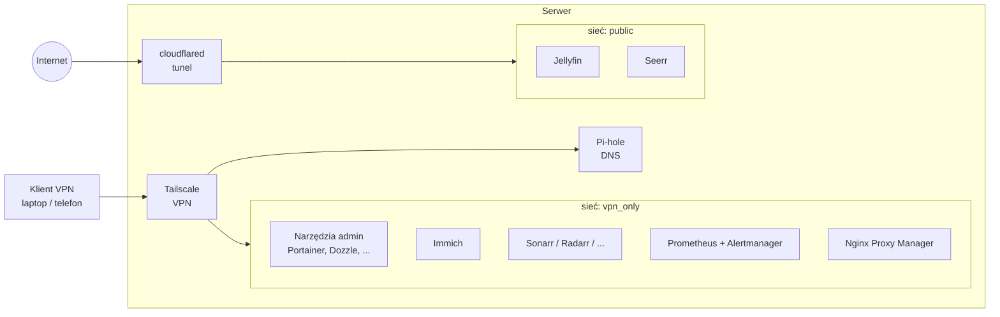

# homelab-infrastructure

Konfiguracja domowego serwera (homelab) oparta w całości na **Docker Compose**. Repozytorium zawiera definicje usług, limity zasobów oraz konfigurację monitoringu. Dzięki temu całe środowisko można odtworzyć na nowej maszynie w kilkanaście minut.

> **Uwaga:** repozytorium nie zawiera żadnych haseł, tokenów ani danych aplikacji. Wszystkie sekrety trafiają do plików `.env`, które są wykluczone z Gita (zob. [Sekrety i bezpieczeństwo](#sekrety-i-bezpieczeństwo)).

---

## Spis treści

1. [Co tu jest](#co-tu-jest)
2. [Architektura](#architektura)
3. [Usługi](#usługi)
4. [Sieci Dockera](#sieci-dockera)
5. [Dostęp zdalny i bezpieczeństwo](#dostęp-zdalny-i-bezpieczeństwo)
6. [Monitoring i alerty](#monitoring-i-alerty)
7. [Limity zasobów](#limity-zasobów)
8. [Struktura repozytorium](#struktura-repozytorium)
9. [Uruchomienie krok po kroku](#uruchomienie-krok-po-kroku)
10. [Zmienne środowiskowe](#zmienne-środowiskowe)
11. [Sekrety i bezpieczeństwo](#sekrety-i-bezpieczeństwo)

---

## Co tu jest

Serwer działa na Linuksie, a każda usługa jest osobnym stosem Compose w swoim katalogu. Pozwala to uruchamiać, aktualizować i usuwać usługi niezależnie od siebie.

Środowisko obejmuje:

- **prywatne zdjęcia i wideo** (alternatywa dla Google Photos),
- **centrum multimedialne** z automatyzacją pobierania i napisów,
- **filtrowanie reklam na poziomie DNS** w całej sieci domowej,
- **pełny monitoring** z alertami wysyłanymi na komunikator,
- **bezpieczny dostęp zdalny** przez VPN oraz tunel dla wybranych usług publicznych,
- **narzędzia administracyjne** (zarządzanie kontenerami, logi, przeglądarka plików, informacja o nowych wersjach obrazów).

## Architektura

Zasada przewodnia: **domyślnie nic nie jest wystawione do internetu**. Większość usług jest dostępna wyłącznie z prywatnej sieci VPN. Tylko kilka wybranych usług jest publikowanych przez szyfrowany tunel.



## Usługi

### Multimedia (`media-stack/`)

| Usługa | Rola |
|---|---|
| **Jellyfin** | Serwer multimediów (filmy, seriale, muzyka). Obsługuje transkodowanie sprzętowe z użyciem GPU/iGPU. |
| **Seerr** | Portal do zgłaszania próśb o nowe tytuły. |
| **Sonarr / Radarr** | Zarządzanie biblioteką seriali i filmów oraz automatyzacja pobierania. |
| **Prowlarr** | Centralny menedżer indeksatorów dla Sonarra i Radarra. |
| **Bazarr** | Automatyczne pobieranie napisów. |
| **qBittorrent** | Klient pobierania. |
| **FlareSolverr** | Pomocnik do obsługi stron zabezpieczonych przed botami. |
| **MeTube** | Interfejs webowy do pobierania materiałów wideo. |

Wszystkie usługi współdzielą jeden katalog danych (`DATA_ROOT`), dzięki czemu pobrane pliki mogą być przenoszone do biblioteki bez kopiowania.

### Zdjęcia (`immich/`)

**Immich** to samodzielnie hostowana aplikacja do kopii zapasowych zdjęć i wideo z telefonów. W skład stosu wchodzą:

- serwer aplikacji,
- usługa uczenia maszynowego (rozpoznawanie twarzy, wyszukiwanie semantyczne),
- baza PostgreSQL z rozszerzeniami wektorowymi,
- Redis/Valkey jako cache.

Obrazy bazy danych i cache są przypięte do konkretnych wersji (hash), a Watchtower jest dla nich wyłączony. Dzięki temu automatyczna aktualizacja nie zepsuje bazy.

### Sieć i dostęp

| Usługa | Rola |
|---|---|
| **Tailscale** | Prywatny VPN. Daje bezpieczny dostęp do serwera z dowolnego miejsca bez otwierania portów na routerze. |
| **cloudflared** | Klient tunelu Cloudflare. Publikuje wybrane usługi w internecie bez otwierania portów i bez ujawniania adresu IP serwera. |
| **Pi-hole** | Serwer DNS blokujący reklamy i trackery w całej sieci. Działa w trybie `host`, ponieważ musi nasłuchiwać na standardowym porcie DNS. |
| **Nginx Proxy Manager** | Wewnętrzny reverse proxy, który pozwala używać czytelnych nazw domen zamiast numerów portów. |

### Administracja i narzędzia

| Usługa | Rola |
|---|---|
| **Portainer** | Graficzne zarządzanie kontenerami, wolumenami i sieciami. |
| **Dozzle** | Podgląd logów kontenerów na żywo w przeglądarce. |
| **Diun** | Sprawdza co 6 godzin, czy dla używanych obrazów pojawiły się nowe wersje, i wysyła powiadomienie. Sam niczego nie aktualizuje. |
| **File Browser** | Przeglądarka plików z interfejsem webowym. |
| **Speedtest** | Własny test prędkości sieci lokalnej. |

### Monitoring (`monitoring/`)

Szczegóły w sekcji [Monitoring i alerty](#monitoring-i-alerty).

## Sieci Dockera

Segmentacja sieci ogranicza, które kontenery mogą ze sobą rozmawiać. Używane są trzy sieci:

| Sieć | Typ | Przeznaczenie |
|---|---|---|
| `vpn_only` | zewnętrzna (tworzona ręcznie) | Usługi prywatne, dostępne wyłącznie przez VPN. Dotyczy większości stosu. |
| `public` | zewnętrzna (tworzona ręcznie) | Usługi, do których tunel ma prawo się łączyć (Jellyfin, Seerr) oraz sam `cloudflared`. |
| `media_link` | wewnętrzna dla stosu multimediów | Łączy Jellyfin i Seerr z Sonarrem i Radarrem, żeby usługi publiczne mogły komunikować się z prywatnymi bez dostępu do reszty sieci prywatnej. |

Pi-hole i Tailscale działają w sieci hosta (`network_mode: host`), bo muszą obsługiwać DNS i interfejs VPN na poziomie systemu.

## Dostęp zdalny i bezpieczeństwo

Ochrona opiera się na kilku warstwach:

1. **Porty są domyślnie przypięte do interfejsu lokalnego.** W każdym pliku Compose porty mają postać `${BIND_IP:-127.0.0.1}:port:port`. Jeśli zmienna `BIND_IP` nie jest ustawiona, usługa jest dostępna tylko z samego serwera. Ustawienie jej na adres interfejsu VPN udostępnia usługi wyłącznie w prywatnej sieci VPN.
2. **Brak otwartych portów na routerze.** Zdalny dostęp odbywa się przez Tailscale (prywatnie) lub przez tunel Cloudflare (publicznie, tylko wybrane usługi).
3. **Segmentacja sieci Dockera** (opisana wyżej) ogranicza skutki ewentualnego włamania do usługi publicznej.
4. **Sekrety poza repozytorium.** Tokeny i hasła są wczytywane ze zmiennych środowiskowych.
5. **Powiadomienia o aktualizacjach.** Diun informuje o nowych wersjach obrazów, więc łatki bezpieczeństwa nie umykają.

## Monitoring i alerty

Stos monitoringu składa się z:

- **Prometheus** zbiera metryki co 15 sekund i przechowuje je przez 15 dni,
- **node-exporter** dostarcza metryki maszyny (CPU, RAM, dysk),
- **cAdvisor** dostarcza metryki poszczególnych kontenerów,
- **Alertmanager** wysyła powiadomienia na komunikator,
- **Dozzle** pokazuje logi kontenerów na żywo.

Zdefiniowane reguły alertów (`monitoring/prometheus/alert.rules.yml`):

| Alert | Warunek | Poziom |
|---|---|---|
| `ContainerDown` | kontener nie odpowiada przez 2 min | krytyczny |
| `HighCPUUsage` | CPU powyżej 90% przez 5 min | ostrzeżenie |
| `HighMemoryUsage` | RAM powyżej 90% przez 5 min | ostrzeżenie |
| `LowDiskSpace` | mniej niż 10% wolnego miejsca na dysku głównym przez 5 min | krytyczny |

Konfiguracja powiadomień nie jest przechowywana w repozytorium. W katalogu `monitoring/alertmanager/` znajduje się tylko plik wzorcowy `alertmanager.yml.example`. Skopiuj go do `alertmanager.yml` i uzupełnij własnymi danymi (token bota i identyfikator czatu).

## Limity zasobów

Każda usługa ma w pliku `docker-compose.override.yml` własne limity pamięci i CPU. Docker Compose wczytuje ten plik automatycznie obok `docker-compose.yml`, więc osobna flaga nie jest potrzebna.

Pozwala to uniknąć sytuacji, w której jedna usługa (np. wczytująca modele uczenia maszynowego) zajmie całą pamięć serwera i pociągnie za sobą pozostałe. Limity są dobrane do możliwości sprzętu. Jeśli używasz mocniejszej lub słabszej maszyny, dostosuj je w plikach `override`.

Podział na dwa pliki ma też drugi cel: `docker-compose.yml` opisuje **co** działa, a `docker-compose.override.yml` opisuje **na jakim sprzęcie**. Dzięki temu pierwszy można łatwo przenosić między maszynami.

## Struktura repozytorium

```
homelab-infrastructure/
├── cloudflared/            tunel Cloudflare
├── diun/                   powiadomienia o nowych wersjach obrazów
├── filebrowser/            przeglądarka plików
├── immich/                 zdjęcia i wideo
├── media-stack/            Jellyfin, Seerr, *arr, qBittorrent, MeTube
├── monitoring/             Prometheus, Alertmanager, cAdvisor, Dozzle
│   ├── alertmanager/       szablon konfiguracji alertów
│   └── prometheus/         konfiguracja i reguły alertów
├── nginx-proxy-manager/    wewnętrzny reverse proxy
├── pihole/                 DNS z blokowaniem reklam
├── portainer/              zarządzanie kontenerami
├── speedtest/              test prędkości sieci
└── tailscale/              VPN
```

W każdym katalogu znajdują się:

- `docker-compose.yml`, czyli definicja usługi,
- `docker-compose.override.yml`, czyli limity zasobów,
- `.env.example`, czyli wzór zmiennych środowiskowych (jeśli usługa ich używa).

## Uruchomienie krok po kroku

### Wymagania

- Linux z zainstalowanym Dockerem i wtyczką Docker Compose v2,
- konto Tailscale (do zdalnego dostępu),
- konto Cloudflare z utworzonym tunelem (tylko jeśli chcesz publikować usługi),
- opcjonalnie GPU/iGPU dla transkodowania sprzętowego w Jellyfin.

### 1. Sklonuj repozytorium

```bash
git clone https://github.com/<twoj-login>/homelab-infrastructure.git
cd homelab-infrastructure
```

### 2. Utwórz sieci zewnętrzne

```bash
docker network create vpn_only
docker network create public
```

### 3. Przygotuj pliki `.env`

W każdym katalogu usługi znajduje się plik `.env.example` ze wzorem. Skopiuj go i uzupełnij własnymi wartościami (zmienne opisane są [poniżej](#zmienne-środowiskowe)):

```bash
cp media-stack/.env.example media-stack/.env
```

Powtórz to dla każdej usługi, którą chcesz uruchomić.

### 4. Uruchom usługi

Najpierw sieć i DNS, potem reszta:

```bash
cd tailscale && docker compose up -d && cd ..
cd pihole && docker compose up -d && cd ..
```

Pozostałe usługi uruchamiaj w dowolnej kolejności:

```bash
cd media-stack && docker compose up -d
```

Sprawdzenie stanu:

```bash
docker compose ps
```

### 5. Skonfiguruj Tailscale

Po pierwszym uruchomieniu kontenera `tailscale` zaloguj go do swojej sieci VPN, korzystając z linku wyświetlonego w logach (`docker compose logs tailscale`).

## Zmienne środowiskowe

Poniżej wyłącznie nazwy zmiennych i przykładowe wartości. Własne wartości trzymaj tylko w lokalnych plikach `.env`.

| Zmienna | Używana przez | Opis |
|---|---|---|
| `BIND_IP` | większość usług | Adres, na którym nasłuchują porty. Domyślnie `127.0.0.1`. |
| `TZ` | media-stack, pihole | Strefa czasowa, np. `Europe/Warsaw`. |
| `PUID`, `PGID` | media-stack | Identyfikatory użytkownika i grupy, które będą właścicielami plików. |
| `DATA_ROOT` | media-stack | Katalog z danymi multimedialnymi. |
| `CONFIG_ROOT` | media-stack | Katalog z konfiguracją usług. |
| `TUNNEL_TOKEN` | cloudflared | Token tunelu Cloudflare. |
| `TELEGRAM_TOKEN` | diun | Token bota do powiadomień. |
| `TELEGRAM_CHAT_ID` | diun | Identyfikator czatu, na który trafiają powiadomienia. |
| `WEBPASSWORD` | pihole | Hasło do panelu administracyjnego. |
| `UPLOAD_LOCATION` | immich | Katalog ze zdjęciami. |
| `DB_DATA_LOCATION` | immich | Katalog z danymi bazy. |
| `DB_USERNAME`, `DB_PASSWORD`, `DB_DATABASE_NAME` | immich | Dane dostępowe do bazy. |
| `IMMICH_VERSION` | immich | Wersja Immicha (domyślnie `release`). |

Gotowe wzory znajdziesz w plikach `.env.example` w katalogach poszczególnych usług.

## Sekrety i bezpieczeństwo

- Pliki `.env` oraz `*.env` są ignorowane przez Git. Wyjątkiem są pliki `.env.example`, które zawierają wyłącznie wartości zastępcze.
- Dane aplikacji (bazy, konfiguracje, biblioteki zdjęć, stan Tailscale, certyfikaty) również są w `.gitignore`.
- Plik `alertmanager.yml` z prawdziwymi danymi nie trafia do repozytorium. Udostępniony jest tylko szablon `.example`.
- Przed publikacją własnej kopii sprawdź historię commitów pod kątem przypadkowo zapisanych sekretów (np. `git log -p | grep -i token`). Jeśli jakiś sekret kiedyś trafił do repozytorium, **unieważnij go i wygeneruj nowy**, bo samo usunięcie pliku nie usuwa go z historii.
- Kontenery zarządzające Dockerem (Portainer, Dozzle, Diun) mają dostęp do gniazda Dockera. To świadomy kompromis, który wymaga, by ich panele były dostępne wyłącznie przez VPN.
- Obrazy z tagiem `latest` są wygodne, ale mogą wprowadzić zmiany niekompatybilne wstecz. Diun pomaga kontrolować, kiedy aktualizować.

## Licencja

Dowolne wykorzystanie na własną odpowiedzialność. Używane aplikacje mają własne licencje opisane w ich repozytoriach.
